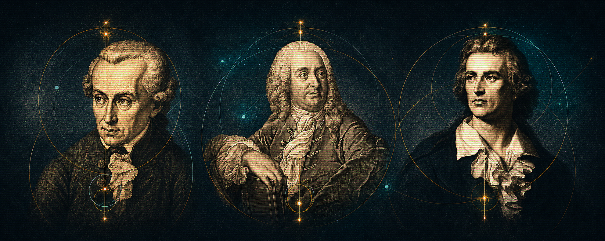
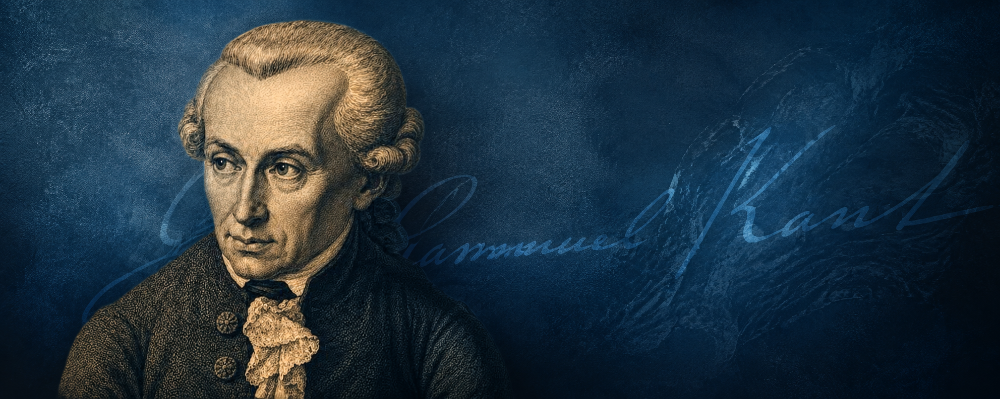

# :octicons-info-24: Apresentação do Evento

<!--  -->

O Programa de Pós-Graduação em Filosofia e os grupos de pesquisa “Kant e o kantismo” e “Estética, Idealismo e Romantismo” promoverão dos dias 24, 25 e 26 de agosto de 2026, o VIII Colóquio Kant e o Kantismo, dando sequência aos eventos dedicados ao estudo da Obra do mais importante e influente filósofo moderno, tanto na Alemanha quanto no mundo, afinal, suas três Críticas redefiniram e estabeleceram o mapa em que se inscrevem os domínios da Filosofia até hoje. Para o VIII Colóquio propomos como tema “História da Filosofia Alemã” em função dos interesses distintos de nossos convidados e dos pesquisadores do PPGFIL. Entre os convidados, teremos um especialista em Christian Wolff, o que amplia o horizonte compreensivo da Filosofia Alemã, além de nos pôr em contato com uma referência importante para a formação de Kant e a para a reformulação crítica dos estudos filosóficos na Alemanha.

Nossa programação contará com a participação dos professores Heiner Klemme, um dos mais eminentes especialistas em Kant na atualidade e docente da Universität Halle-Wintenberg, e John Walsh, da mesma Universidade. Junto com eles, teremos os professores e organizadores do evento: Luís Eduardo Ramos de Souza e Pedro Paulo da Costa Corôa, e a professora Aline Brasiliense dos Santos Brito. Serão também expositores em mesas de comunicação egressos da Pós-Graduação em Filosofia da UFPA, além de docentes em estágio de finalização de suas pesquisas.

<strong>A organização do VIII Colóquio Kant e o Kantismo</strong>   Belém, agosto de 2026.

----

English:

The Graduate Program in Philosophy and the research groups “Kant and Kantianism” and “Aesthetics, Idealism, and Romanticism” will host, on August 24, 25, and 26, 2026, the 8th Kant and Kantianism Colloquium, continuing the series of events dedicated to the study of the work of the most important and influential modern philosopher, both in Germany and worldwide; after all, his three Critiques redefined and established the framework within which the fields of philosophy are organized to this day. For the 8th Colloquium, we propose the theme “History of German Philosophy” in light of the diverse interests of our guests and the researchers from the PPGFIL. Among our guests will be an expert on Christian Wolff, which broadens our understanding of German philosophy and connects us with a key figure in Kant’s intellectual formation and in the critical reformulation of philosophical studies in Germany.

Our program will feature Professors Heiner Klemme—one of today’s most eminent experts on Kant and a faculty member at the University of Halle-Wittenberg—and John Walsh, from the same university. Joining them will be the professors and event organizers: Luís Eduardo Ramos de Souza and Pedro Paulo da Costa Corôa, along with Professor Aline Brasiliense dos Santos Brito. Graduates of UFPA’s Graduate Program in Philosophy will also present at the panels, along with faculty members in the final stages of their research.

[:fontawesome-regular-house: Retornar à Página Inicial](index.md){ .md-button .md-button--primary }