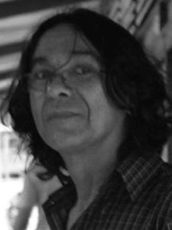
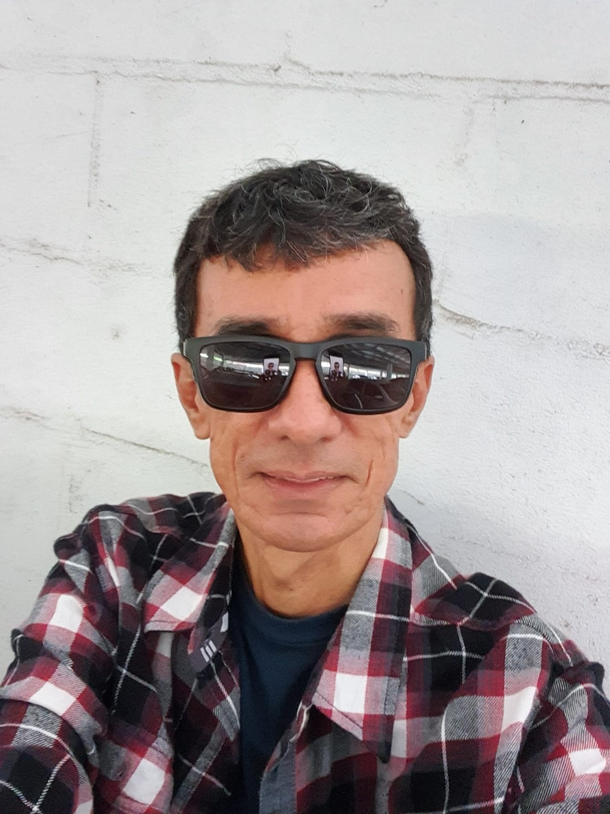

## Professores

  

  

    
<strong>Prof. Dr. PEDRO PAULO DA COSTA CORÔA</strong> 
    Universidade Federal do Pará

    
 - <strong>Comunicação:</strong> "Imaginação radical"

    
    <blockquote style="font-size: 11pt;">
 
    Possui doutorado em Filosofia pela Universidade de São Paulo, com estágio, sanduíche na Alemanha (Universität Erlangen-Nürnberg - 1996). Atualmente é Professor Associado 3 da Universidade Federal do Pará. Tem experiência nas áreas de Teoria do Conhecimento, Ética e Estética. Faz uso, principalmente, das obras de Kant, Rousseau e Aristóteles. É professor do quadro permanente do Mestrado em Filosofia da Faculdade de Filosofia da UFPA e do Doutorado em Ciências Sociais (UFPA). Compõe o Grupo de Sustentação do GT "Rousseau e o Iluminismo" (ANPOF) e é membro da Sociedade Kant Brasileira. Estágio Sênior na Marthin-Luther-Universität Halle-Wittenberg, de 08/2015 a 07/2016. Coordenador do Grupo de Pesquisa "Estética, Idealismo e Romantismo". Atualmente é coordenador do Programa de Pós-Graduação em Filosofia da UFPA. 
    
    </blockquote>
  
  

  

  

    
<strong>Prof. Dr. LUÍS EDUARDO RAMOS DE SOUZA</strong> 
    Universidade Federal do Pará

    
 - <strong>Comunicação:</strong> "Sobre a forma da Crítica da razão pura de Kant"

    <blockquote style="font-size: 11pt;">

    Graduação em Matemática pela Universidade Federal do Pará (1986), Graduação em Filosofia pela Universidade Federal do Pará (1992), Mestrado em Filosofia pela Universidade Federal de Minas Gerais (2001) e Doutorado em Filosofia pela Universidade Federal de Minas Gerais (2007). Interesse na área de Filosofia Moderna em geral, Lógica e Teoria do Conhecimento, com foco nos seguintes temas: Criticismo e Idealismo Alemão, Filosofia Oriental, Filosofia da Mente, Filosofia Analítica, Teoria de Sistemas.
     
    </blockquote>
  

## Doutores

- **Dr. ALINE BRASILIENSE DOS SANTOS BRITO**  
> <strong>Comunicação:</strong> “Existência e representação: um diálogo entre Kant e a filosofia Sarvāstivāda”  

## Mestres

- **MSc. ARTHUR HENRIQUE SOARES SANTOS**  
> <strong>Comunicação:</strong> “O argumento de Kant a favor da dependência da prova cosmológica em relação à ontológica”  

- **MSc. JOSÉ PEREIRA DO VALE FILHO**  
> <strong>Comunicação:</strong> “A natureza do princípio de razão suficiente em Kant: entre a lógica, o transcendental e a metalógica”  

## Mestrandos

- **PAULO ROBERTO MARTINS CUNHA**  
> "Kant e a Fundamentação da Moral: para além do ceticismo"

[Retornar à Página Inicial](index.md){ .md-button .md-button--primary }
