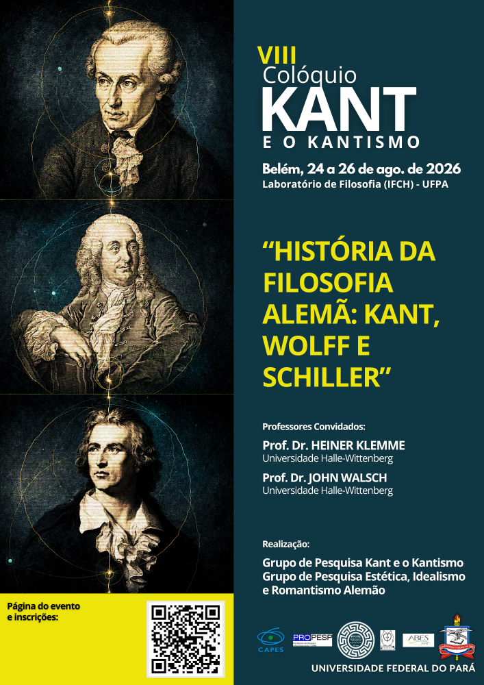

<h1 class="event-name"> <strong>VIII</strong> Colóquio Kant e o Kantismo</h1>

## História da Filosofia Alemã: Kant, Wolff e Schiller 

:octicons-calendar-24: Data: 
Belém, 24 a 26 de agosto de 2026  

:octicons-location-24: Local: 
UNIVERSIDADE FEDERAL DO PARÁ 
Instituto de Filosofia e Ciências Humanas (IFCH)  
Laboratório de Filosofia  

:octicons-organization-16: Organização e Realização:  
Grupo de Pesquisa Kant e o Kantismo 
Grupo de Pesquisa Estética, Idealismo e Romantismo Alemão

[:material-transcribe-close: Inscrições](inscricao.md){ .md-button .md-button--primary }

!!! note "Apoio:"

