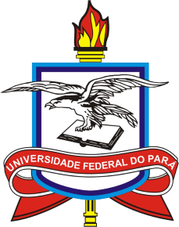

<h1 class="event-name"> <strong>VIII</strong> Colóquio Kant e o Kantismo</h1>

 História da Filosofia Alemã: _Kant_, _Wolff_ e _Schiller_ 

!!! abstract "ATENÇÃO:  Teremos transmissão ao vivo! :fontawesome-solid-video-camera:" 
    - As palestras dos professores convidados serão transmitidas ^^ao vivo^^ pelo YouTube.
    - Os links para as transmissões serão postados aqui, ao longo do evento. 
    - Aproveite e visite o [canal do grupo no :fontawesome-brands-youtube:{ .youtube } YouTube](https://www.youtube.com/@Kant.Kantismo).
    
    <i>Mantenha-se atualizado!</i>

:octicons-calendar-24: Data: 
24, 25 e 26 de agosto de 2026  

:octicons-location-24: Local: 
UNIVERSIDADE FEDERAL DO PARÁ 
Instituto de Filosofia e Ciências Humanas (IFCH)  
Laboratório de Filosofia  
Belém - Pará - Brasil  

:octicons-organization-16: Organização e Realização:  
Grupo de Pesquisa Kant e o Kantismo 
Grupo de Pesquisa Estética, Idealismo e Romantismo Alemão

[:material-transcribe: Inscrições](inscricao.md){ .md-button .md-button--primary }

!!! note "Apoio:"

    { width="80"  height="auto"}
    { width="100"  height="auto"}
    { width="60"  height="auto"}
    { width="200"  height="auto"}
    { width="180"  height="auto"}
    { width="120"  height="auto"}

